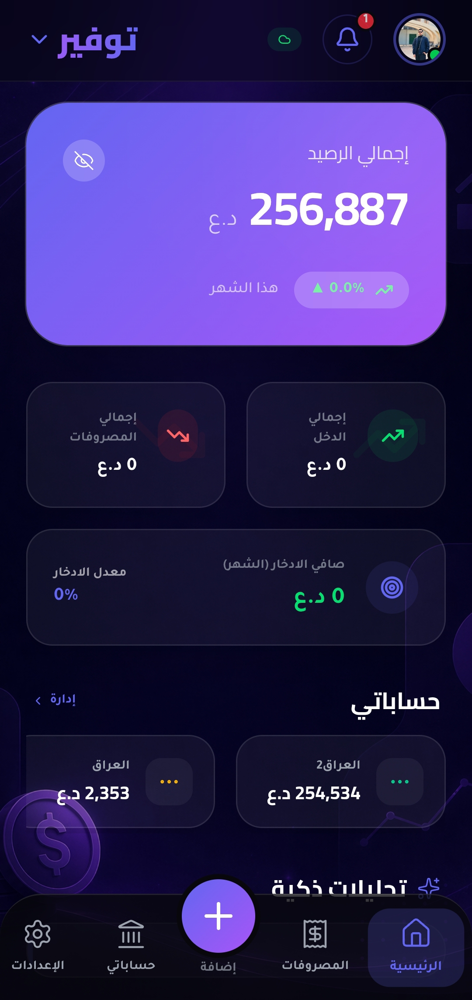
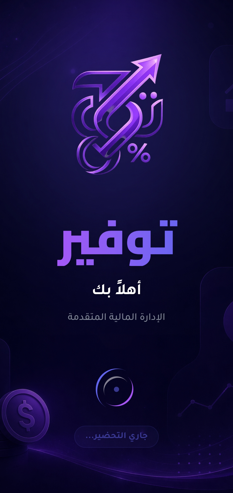
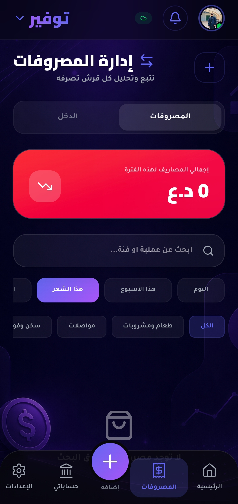
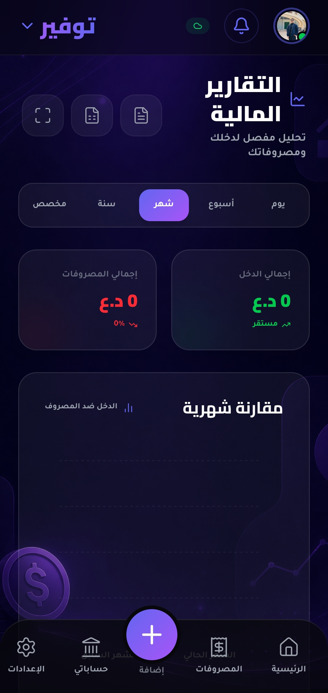

# 🏦 Tawfeer (Financial App)

<p align="center">
  
</p>

## 🌟 Comprehensive Project Overview
"Tawfeer" is an integrated financial management application designed to simplify personal financial planning. The app goes beyond simply tracking expenses; it extends into a comprehensive system that includes debt management, budgets, bank accounts, and Savings Challenges. The user interface was carefully designed to provide a smooth, modern experience with built-in Dark Mode support.

---

## ✨ Comprehensive Features

### 1. Smart Budget Management
The app allows you to set a budget for each spending category (e.g., Food, Transportation, Bills). The app automatically calculates the remaining budget and provides visual alerts if you exceed the allowed limit.

### 2. Income and Expense Tracking
Through a fast input interface, you can add financial transactions, specifying the date, category, and associated account (cash, credit card, etc.).

### 3. Multi-Account Management
You can add multiple accounts (e.g., cash wallet, Mastercard, ZainCash), and the system will link purchases or revenues to the designated account to update its balance automatically.

### 4. Debt and Claims Management
A dedicated section to record "Money Owed to You" and "Money You Owe," complete with due dates and debt status (Paid / Active).

### 5. Savings Goals and Challenges
The app includes a system to track long-term savings goals and short-term savings challenges (like the 52-Week Challenge) to motivate users to save money.

### 6. Detailed Reports and Charts
An advanced Dashboard featuring interactive charts (Pie Charts & Line Charts) to accurately analyze monthly and yearly expenses.

---

## 🛠️ Infrastructure and Tech Stack

The project was built using the latest Frontend and Backend technologies to ensure high performance and fast responsiveness:

- **Frontend Core:** React.js (latest versions).
- **Styling:** Tailwind CSS for building responsive and fast interfaces.
- **Animations:** Framer Motion for bringing life and smoothness to page and window transitions.
- **Icons:** Lucide-React library, rich with modern icons.
- **Charts:** Recharts for creating interactive graphs.
- **Backend & Database:** Firebase (Firestore for live NoSQL database, and Firebase Auth for authentication and account security).
- **Build Tool:** Vite to ensure fast project compilation and building.

---

## 📸 Detailed App Tour

### 🔐 Login and Getting Started
The app starts with a Splash screen, followed by the login and registration interface, which supports email and Google accounts.
<p align="center">
  
  
  
</p>

### 💰 Expense and Budget Management
When adding a new expense, you can choose the category, the account it's withdrawn from, and the operation classification. Budgets update instantly and show you the consumption percentage visually.
<p align="center">
  
  
  
</p>

### 📈 Advanced Financial Reports
All data is aggregated and displayed on the reports page, where you can filter data by dates and monitor Cash Flow.
<p align="center">
  
  
</p>

### 🎯 Savings Goals
Set financial goals and follow the progress bar for each goal until it's completed.
<p align="center">
  
</p>

### 🤝 Debts and Liabilities
A clean interface to know who you owe and who owes you, with a quick button to log a payment when a debt is settled.
<p align="center">
  
</p>

### ⚙️ Settings and Dropdown Menus
A comprehensive settings system that allows adjusting the currency, dark/light mode, and modifying the personal account.
<p align="center">
  
  
  
</p>

---

## 💻 Local Installation

If you want to run the project on your machine to see the code and test it:

1. Clone the project:
   ```bash
   git clone https://github.com/uvvvo/Tawfeer-Open.git
   ```
2. Navigate to the folder and install packages:
   ```bash
   cd Tawfeer-Open
   npm install
   ```
3. Create a new project in Firebase and copy your API configuration.
4. Open the `firebase-applet-config.json` file and place your Firebase settings there.
5. Run the development server:
   ```bash
   npm run dev
   ```

---

## 🚧 Under Development (Ongoing Features and Known Issues)

Since this app is a personal and ongoing effort, there are some aspects I haven't finished yet:
- 💳 **Payment Gateway and Premium Registration (Stripe):** The upgrade system for paid subscriptions and payment processing via Stripe is still under implementation.
- 📱 **Google Login Issue on Mobile:** There is currently a technical issue when attempting to use Google (Gmail) login from within mobile browsers or when converted to an app, and it is currently being addressed.

---

## ⚖️ Rights and Ownership
This project is offered as Open Source for learning, sharing knowledge, and as a portfolio piece.
**Important Notice:** All intellectual property rights, design, and the core concept belong to me as the project owner and programmer. Using the code for educational purposes is allowed, but cloning the project for commercial launch without prior permission from me is strictly prohibited.

---
**Thought, Designed, and Developed with ❤️**

## 📬 Let's Connect!
Feel free to reach out if you have any questions, want to collaborate, or just want to connect:

<p align="left">
  <a href="https://instagram.com/uvvvo" target="_blank">
    
  </a>
  <a href="https://t.me/ssscw" target="_blank">
    
  </a>
  <a href="https://wa.me/9647813563139" target="_blank">
    
  </a>
</p>

